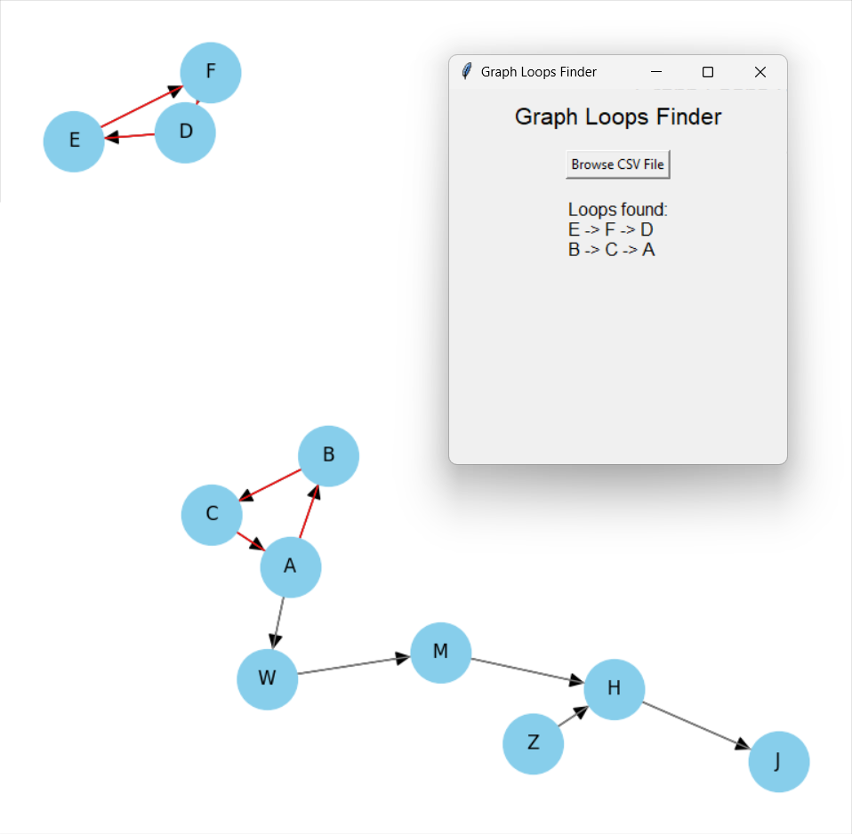

# 🔄 Graph Loops Finder
[](https://github.com/XMaroRadoX/Graph-Loops-Finder/actions/workflows/build.yml)

Graph Loops Finder is a Python application that helps you find loops in a directed graph represented as edges in a CSV file.

## Table of Contents

- [Overview](#overview)
- [Features](#features)
- [Demo](#demo)
- [Requirements](#requirements)
- [Installation](#installation)
- [Usage](#usage)
- [CSV File Format](#csv-file-format)
- [Examples](#examples)
- [Contributing](#contributing)
- [License](#license)

## Overview

Graph Loops Finder is a command-line tool that takes a CSV file containing graph edges as input and identifies all loops in the graph. Loops are cycles of nodes where a path returns to the starting node. The application utilizes NetworkX library for graph representation and simple cycle detection.

## Features

- ✔️ Identifies loops in a directed graph represented as edges in a CSV file.
- 📈 Generates a visual representation of the graph with highlighted loops.
- 📋 Outputs the detected loops in a user-friendly format.

## Demo



## Requirements

- 🐍 Python 3.x
- 🔗 NetworkX library
- 📊 Matplotlib library
- 🐼 Pandas library

## Installation

1. 📥 Clone the repository:

```bash
git clone https://github.com/XMaroRadoX/graph-loops-finder.git
cd graph-loops-finder

```

2. 📦 Install the required dependencies:

```bash
pip install -r requirements.txt

```

3. 🏗️ Build the app:

```bash
pip install pyinstaller
python -m PyInstaller --onefile app/gui.py

```

or you can use the run.sh script to quickly get up and running

## Usage

To find loops in your graph, run the following command:

```bash
python graph_loops_finder.py /path/to/edges.csv

```

Replace `/path/to/edges.csv` with the path to your CSV file containing the graph edges.

## CSV File Format

The CSV file should contain two columns: the source node and the target node, separated by a comma (`,`). Each row represents a directed edge in the graph.

Example CSV file:

```sh
A,B
B,C
C,A
D,E
E,F
F,D

```

## Examples

Let's consider the following CSV file `edges.csv` representing a graph:

```sh
A,B
B,C
C,A
D,E
E,F
F,D

```

Run the application:

```bash
python graph_loops_finder.py edges.csv

```

The output will be:

```html
Loops found:
A -> B -> C
E -> F -> D

```

A visualization of the graph with highlighted loops will also be displayed.

## Contributing

🤝 Contributions are welcome! Please feel free to open issues, submit pull requests, or provide feedback.

## License

This project is licensed under the  GNU GENERAL PUBLIC License - see the [LICENSE](LICENSE) file for details.
